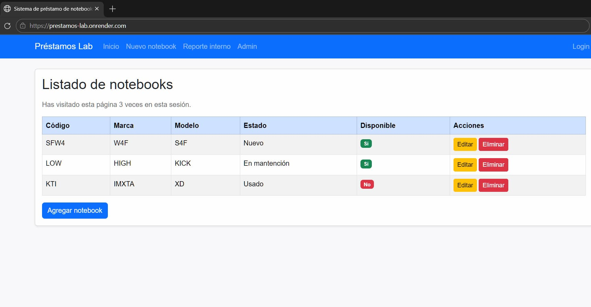
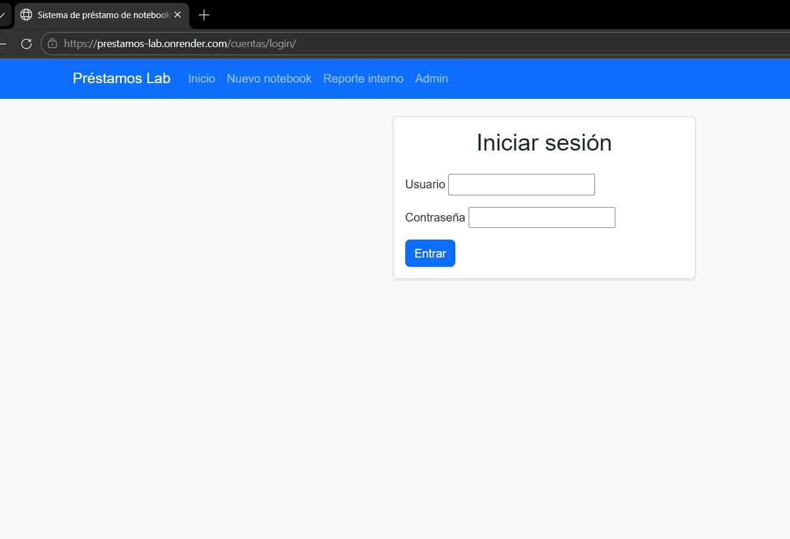
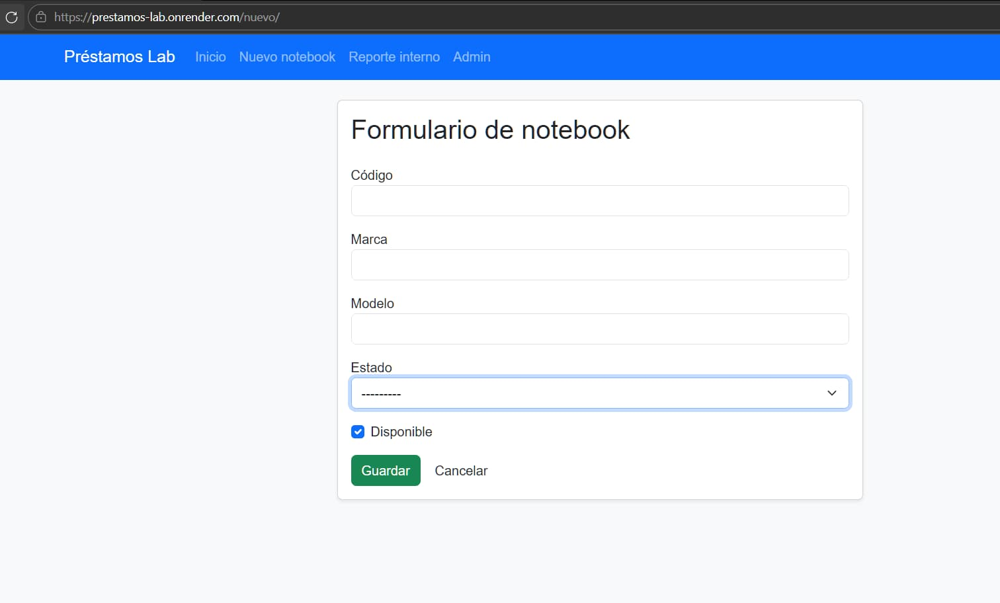

# Préstamos Lab

Aplicación web hecha con **Django** para registrar y administrar un inventario simple de notebooks (equipos) y su disponibilidad.

## Demo en producción

Accede a la aplicación aquí:
https://prestamos-lab.onrender.com/

---

## Funcionalidades

* Listado de notebooks con estado y disponibilidad.
* Crear / editar / eliminar notebooks.
* Autenticación (login / logout) y panel de administración (`/admin/`).
* Reporte interno con métricas (total, disponibles, en mantención) protegido por grupo y permiso.

---

## Requisitos

* Python 3.13+
* Django 6.x

---

## Instalación y ejecución

```bash
python -m venv .venv
```

Activar entorno virtual:

* Windows (PowerShell): `.venv\Scripts\Activate.ps1`
* macOS/Linux: `source .venv/bin/activate`

Instalar dependencias y levantar el proyecto:

```bash
pip install -r requirements.txt
python manage.py migrate
python manage.py createsuperuser
python manage.py runserver
```

Abrir:

* App: http://127.0.0.1:8000/
* Admin: http://127.0.0.1:8000/admin/
* Login: http://127.0.0.1:8000/cuentas/login/

---

## Acceso al “Reporte interno”

La ruta del reporte es:
http://127.0.0.1:8000/reporte-interno/

Para poder verla, el usuario debe:

1. Estar en el grupo **Encargados**.
2. Tener el permiso **Puede ver reporte interno** (app `inventario`).

Puedes configurarlo desde el panel `/admin/` (Groups/Usuarios → permisos).

---

## Base de datos

El proyecto utiliza **PostgreSQL en la nube mediante Neon** como base de datos en el entorno de producción.

Para desarrollo local, se utiliza SQLite por defecto.

---

## Capturas de pantalla

Las imágenes están dentro de la carpeta `docs/`.

### Inicio



### Login



### Formulario



---

## Notas

* Base de datos local: SQLite.
* Base de datos en producción: PostgreSQL (Neon).
* Configuración actual pensada para desarrollo (por ejemplo `DEBUG=True`).
* Para más documentación revisa: `docs/README.md`
